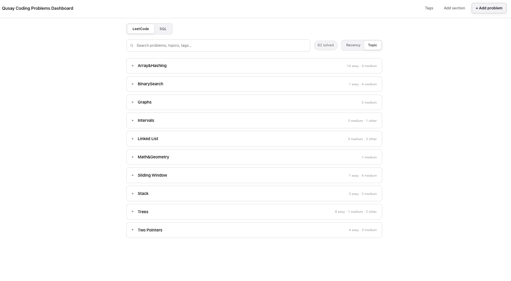
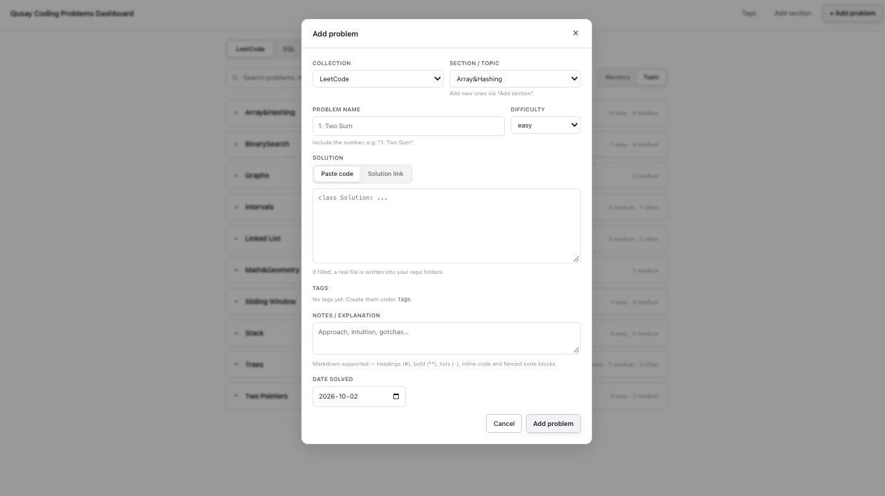
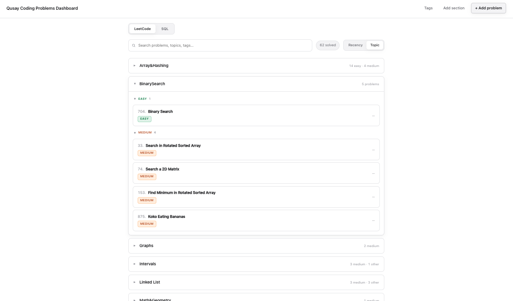
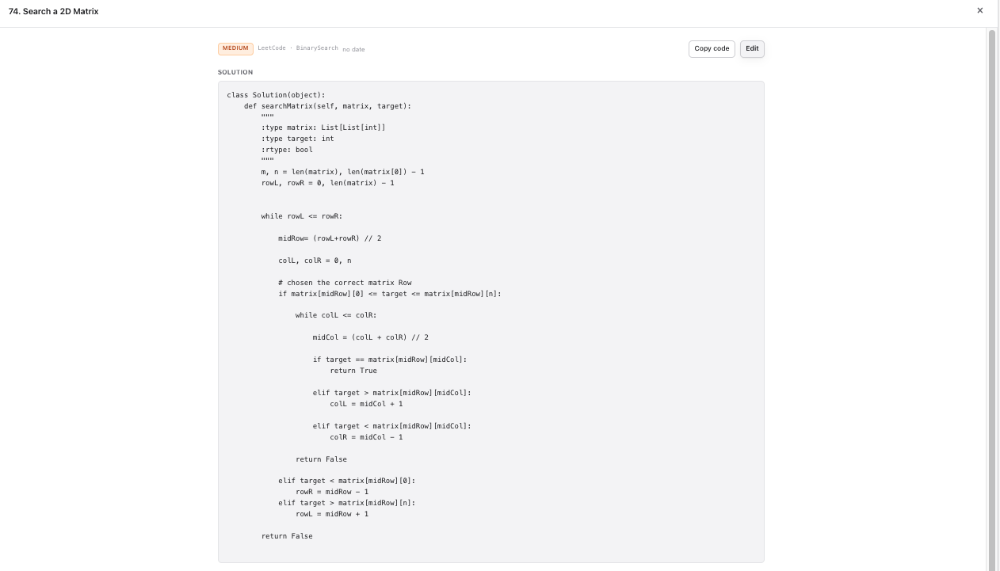
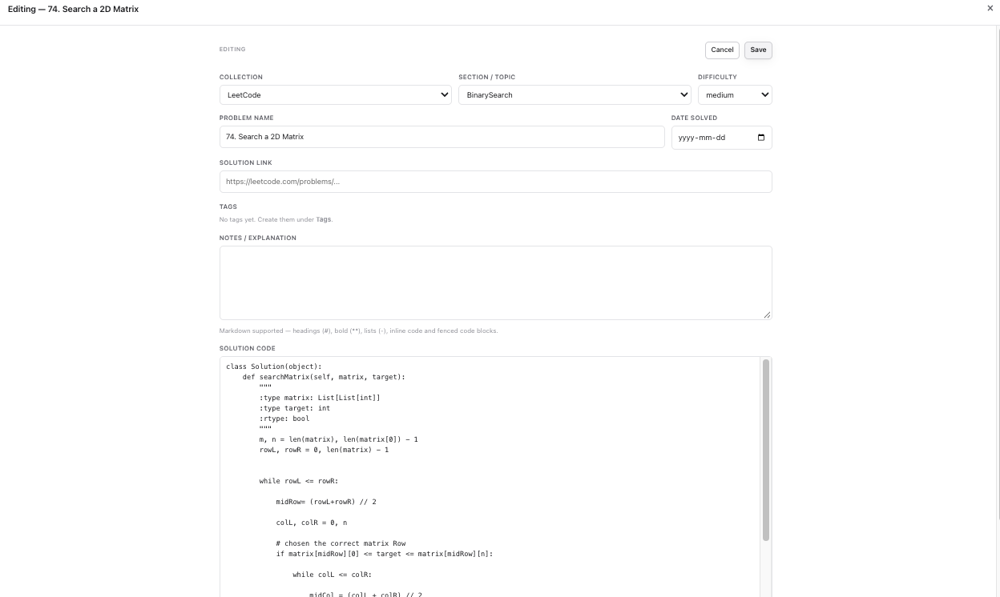
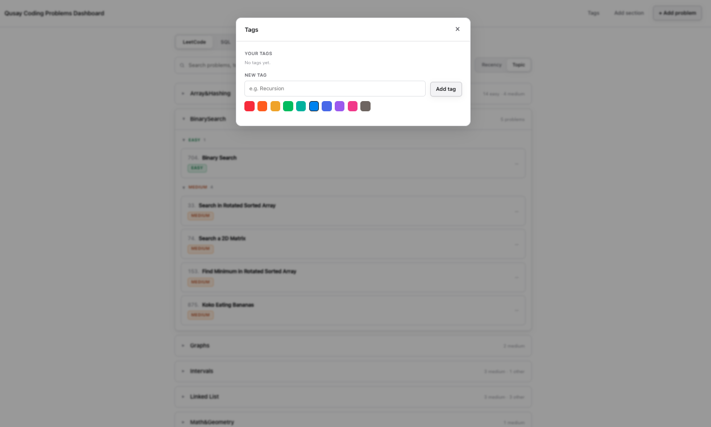

# LeetCode Solutions

My solutions to LeetCode problems, following the [NeetCode](https://neetcode.io) roadmap and Hello Interview prep.

## Structure

- **DSA/** — Python solutions organized by topic (Arrays & Hashing, Two Pointers, Sliding Window, Binary Search, Linked List, Stack, Trees, Graphs, Intervals, Math & Geometry), with subfolders by difficulty.
- **SQL/** — SQL problem solutions (SELECT, JOINs, etc.).
- **src/admin-dashboard/** — a local dashboard to browse, search, and add these solutions (see below).

Files are named by problem number and title, e.g. `2461. Maximum Sum of Distinct Subarrays With Length K.py`.

## Qusay Coding Problems Admin Tracker/Dashboard

A local, dependency-free dashboard (HTML/CSS/JS + a tiny Python standard-library server) for browsing and managing the solutions in this repo.

### Screenshots

**Browse by topic** — collapsible topic cards with per-difficulty counts, a live solved
total, search, LeetCode / SQL tabs, and a Recency / Topic toggle.

**Add a problem** — pick collection, section/topic, and difficulty, then paste code (writes a
real file into the repo) or just give a solution link; add optional tags, Markdown notes, and a date.

**Expanded topic** — each topic opens into collapsible Easy / Medium / Hard groups, with a
difficulty badge on every problem.

**Problem detail** — a full-screen view of the solution, with Copy code and Edit.

**Edit a problem** — change collection, topic, difficulty, name, link, tags, notes, and the
solution code, then Save.

**Tags** — create and color-code tags (the only colored UI) in the Tags panel.

- **Your folders are the source of truth.** It scans `DSA/` and `SQL/`: folder = topic,
`easy`/`med` subfolder = difficulty, filename = name, file contents = solution.
- **Extra metadata** (tags, notes, links, dates) lives in `src/admin-dashboard/data.json`,
created on first run. Keep it in version control to back up your notes/tags.
- **Views:** all problems by **recency**, or by **topic** — each topic is a collapsible
card that opens into collapsible Easy / Medium / Hard groups.
- **Search** with a live total-solved count.
- **Add problem:** enter the name (include the number, e.g. `1. Two Sum`), section,
difficulty, then either paste code or give a solution link. Pasting code writes a real
file into `DSA/<Topic>/<difficulty>/`; link-only problems are stored as metadata.
- **Notes** are written in Markdown and rendered on each problem's full-screen detail page,
alongside the full solution and LeetCode link.
- **Tags** (the only colored UI) and **sections** can be created and deleted in the app.

### Run it

Double-click `src/admin-dashboard/start-dashboard.command` in Finder — it starts the
server and opens your browser. (Closing that Terminal window stops it.)

## License

Licensed under the [Apache License 2.0](LICENSE).